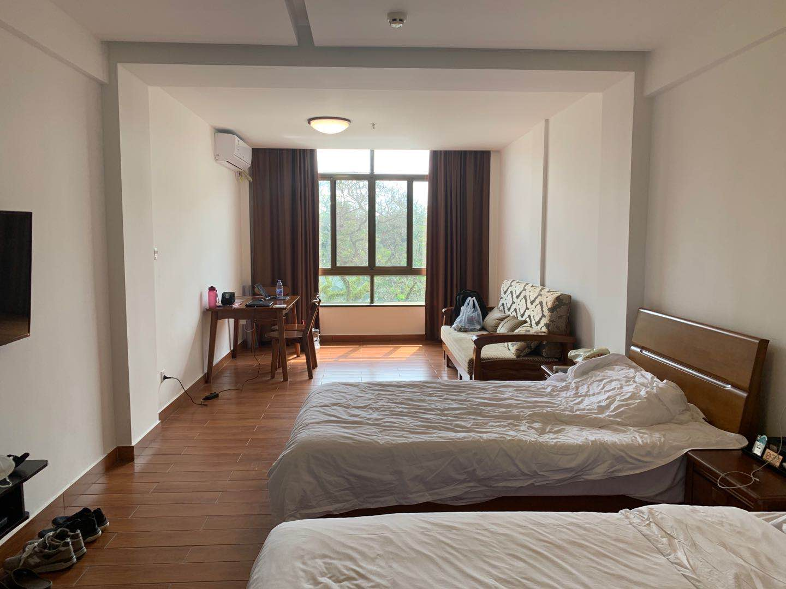
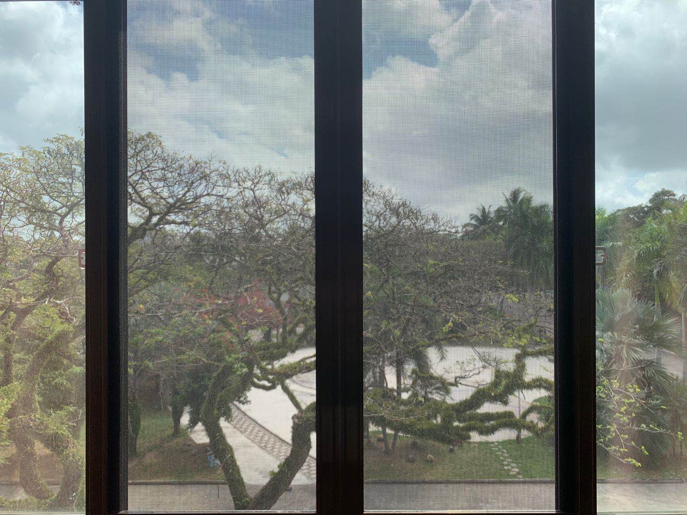

# 隔离日记Day1 - JavaScrip DOM

今天，2020年2月29日，距离新冠病毒大爆发已经超过40天。在广州完成14天隔离后，我又被派到海南琼海这座小城继续隔离。我自己是十分喜欢隔离的，有时间思考并做些自己喜欢的事情。特别是琼海这座小城，典型的热带气候，像把我带回了东南亚的海岛。被关在这座景色气候我的喜欢的“疗养院”，我翻开了JavaScript DOM。





## 一个不是很好的例子

> 正如物理学中的运动与惯性定律所描述的那样，如果人们开始使用一种新技术时没有经过深思熟虑，而这种新技术又很快地成为一种潮流，则纠正在早期养成的坏习惯会非常的困难。

这里展现一个用js实现简单图片库不好的例子。

**index.html**

```html
<!DOCTYPE html>
<html lang="en">
<head>
    <meta charset="UTF-8">
    <title>Image Gallery</title>
    <link rel="stylesheet" href="css/layout.css" media="screen" />
</head>
<body>
    <h1>Snapshots</h1>
    <ul>
        <li>
            <a href="images/dolly.jpeg" title="Dolly's selfie"
               onclick="showPic(this);return false;">Dolly's Selfie</a>
        </li>
        <li>
            <a href="images/vera.jpeg" title="Vera's selfie"
               onclick="showPic(this);return false;">Vera's Selfie</a>
        </li>
    </ul>
    
    <p id="description">Choose an image.</p>

    <script type="text/javascript" src="js/showPic.js"></script>
</body>
</html>
```

**showPic.js** 

```javascript
function showPic(link){
  placeholder= document.getElementById("placeholder");
  src = link.getAtrribute("href");
  placeholder.setAttribute("src", src);
  
  discription = document.getElementById("description")
  text = link.getAttribute("title");
  discription.firstChild.nodeValue = text; // 这里不是应该有属性和文本两个节点吗？
}
```

*（关于子节点是否包括属性节点问题请戳[这里](https://www.cnblogs.com/chen-cong/p/8305781.html)）*

## 一个较好的例子

* 平稳退化：确保网页在没有JavaScript时也能正常工作
* 分离JavaScript：网页的结构与内容和js的行为要尽可能分离
* 向后兼容：确保老版本的浏览器在浏览网页的时候不会死掉
* 确保脚本性能最优化

**index.html**

```html
<!DOCTYPE html>
<html lang="en">
<head>
    <meta charset="UTF-8">
    <title>Image Gallery</title>
    <link rel="stylesheet" href="css/layout.css" media="screen" />
</head>
<body>
    <h1>Snapshots</h1>
    <ul id="gallery">
        <li>
            <a href="images/dolly.jpeg" title="Dolly's selfie">Dolly's Selfie</a>
        </li>
        <li>
            <a href="images/vera.jpeg" title="Vera's selfie">Vera's Selfie</a>
        </li>
    </ul>
    
    <p id="description">Choose an image.</p>

    <script type="text/javascript" src="js/showPic.js"></script>
</body>
</html>
```

**showPic.js**

```javascript
function showPic(node){
    let text;
    if (!document.getElementById("placeholder")) return false;
    let placeholder = document.getElementById("placeholder");
    let src = node.getAttribute("href");
    placeholder.setAttribute("src",src);

    if (node.getAttribute("title"))
        text = node.getAttribute("title");
    else
        text = "";
    let description = document.getElementById("description");
    description.firstChild.nodeValue = text;
    return true;
}

function prepareGallery(){
    if (!document.getElementsByClassName) return false;
    if (!document.getElementById) return false;
    if (!document.getElementById("gallery"))  return false;
    let gallery = document.getElementById("gallery");
    let links = gallery.getElementsByTagName("a");
    for (let i=0; i<links.length; i++){
        links[i].onclick = function(){
            return(!showPic(this));
        }
    }
}
window.onload = prepareGallery;
```

确保脚本的最优性能可以将js或css脚本进行压缩变成如***bootstrap.min.css***格式，其中排版、空格、注释全部被压缩，仅仅满足最基本的编译要求。

**EOF.**