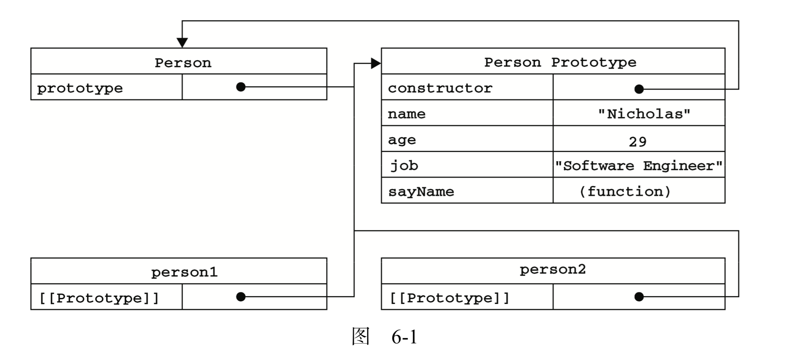

# 浅谈JavaScript面向对象编程

一般OO(Object-Oriented)的语言都有类的概念，但JavaScript中却没有，ES6中实现的class仅是构造函数的语法糖，因此JS中的对象也与别的语言有所不同。可以把JS中的对象理解成无序排列的键值对，其中的值可以是属性也可以是函数。这篇文章将会梳理JS中对象中的常用特性、如何在JS中实现类以及各种方式来继承类。

## 对象基础

### 1. 对象字面量

对象是一个包含了属性及方法的集合。最直接创造对象的方式是通过对象字面量 - 即手动写出对象中的所有内容。一个简单的例子如下，我将写出“我”这个对象。

```javascript
const dolly = {
  name: {
    last: "Zhang",
    first: "Dolly"
  },
  age: 27,
  interests: ["swimming","scuba-diving","climbing"],
  eat() {
    console.log(`${this.name.first} is eating food.`)
  }
}
```

### 2. 点表示法与括号表示法

可以用点表示法与括号表示法来访问对象中的属性及方法。但相比于括号表示法，点表示法有着一些局限性。点表示法只接受对象字面量的成员名字，而不接受变量。如：

```javascript
const dolly = {
  name: {
    first: "Dolly",
    last: "Zhang"
  }
}
const firstName = "first"
console.log(dolly.name.firstName) // Undefined
console.log(dolly.name[firstName]) // "Dolly"
```

### 3. 属性的类型

对象的属性有两种：数据属性和访问器属性。

上面例子中看到的都是数据属性，而访问器属性是指读、写分别以两个函数来实现的属性。

属性也有自己的特性，这些特性决定着这些属性的属性值、是否能遍历、是否可删除等。

#### 数值属性

数值属性有4个特性：

* [[Configurable]] - 指该属性是否能通过delete来进行删除，默认值为true
* [[Enumerable]] - 指该属性是否具有遍历性，默认值为true
* [[Writable]] - 指该属性创建后是否还能修改，默认值为true
* [[Value]] - 保存熟悉的属性值

`Object.defineProperty`和`Object.defineProperties`分别用来单个和批量地修改属性的特性：

```javascript
let obj = {
  name: 'Tom',
  age: 12
}

function test1() {
  Object.defineProperty(obj, 'name', {
    enumerable: false,
    writable: false,
    value: 'Hank'
  })

  console.log(obj.name) // Hank
  obj.name = 'Tom'
  console.log(obj.name) // Hank ;use strict模式下会报错
}

function test2() {
  Object.defineProperties(obj, {
    name: {
      value: 'Hank',
      writable: false
    },
    age: {
      configurable: false
    }
  })
  
  delete obj.age // 无效的, use strict模式下会报错
}
```

注意，`configurable`不仅会使`delete`不可用，修改为false后，无法再为这个特性修改回true，置为false后，除了Writable以外的一切特性都无法再进行修改，修改该特性需慎重。

#### 构造器属性

前面说过，构造器属性是利用两个函数来分开完成它的读与写任务，且构造器属性只能通过`Object.defineProperty`或`Object.defineProperties`来进行设置。它的特性为：

* [[Configurable]] - 指该属性是否能通过delete来进行删除，默认值为true，与数值属性相同
* [[Enumerable]] - 指该属性是否具有遍历性，默认值为true，与数值属性相同
* [[Get]] - 设置属性的读取函数，默认值为undefined
* [[Set]] - 设置属性的写入函数，默认值为undefined

```javascript
function test1() {
  let obj = {
  _age: 12, //加_表示内部属性，只能通过内部方法访问
  isAdult: false
  }
  Object.defineProperty(obj, 'age', {
    configurable: true, // 默认也为true
    get() {
      return _age
  	},
    set(value) {
      this._age = value
      this.isAdult = value >= 18
    }
  })
  
  console.log(this.age) // 12
  console.log(this.isAdult) // false
  this.age = 18
  console.log(this.age) // 18
  console.log(this.isAdult) // true
}
```

构造器属性一般用于写入一个属性后，其他属性根据一些条件跟随它进行改变的情形。

### 3. 读取属性的特性

上面已经提到过了`Object.defineProperty`和`Object.defineProperties`可以修改属性的特性值以及定义构造器属性。ES5提供了`Object.getOwnPropertyDescriptor`的方法来读取属性的特性。

```javascript
const obj = {
  name: 'Tom'
}

const descriptor = Object.getOwnPropertyDescriptor(obj, 'name')
console.log(descriptor.value) // 'Tom'
console.log(descriptor.writable) // true
```

## 构造函数

构造函数是JS中实现“类”的最常用手段。构造函数与普通函数本质上无异。为了区别其不同的目的，规定构造函数首字母大写。普通函数能通过new调用来实现构造函数的功能，构造函数也能通过常规方式来作为一个普通函数使用。下面是一个构造函数的例子：

```javascript
function Person(first, last, age, gender) {
  this.name = {
    first, 
    last
  }
  this.gender = gender
  this.age = age
  this.greeting = function() {
    console.log(`Hi, my name is ${this.name.first} ${this.name.last}`)
  }
}
```

我们可以通过构造函数来创建类的实例，这个过程称为类的实例化。而这个实例，就是一个对象。

```javascript
const person1 = new Person('Dolly', 'Zhang', 27, 'male')
const person2 = new Person('Vera', 'Guan', 27, 'female')
```

这遗留了一个问题，每创建一个实例对象，实例对象中的成员（属性及方法）就被新创造了一份（占用独一份的内存空间）。对于属性，我们是乐于看到的，因为每个对象的名字、年龄、性别都与这个对象是强相关的。但对于方法，我们希望每个实例只保存指向存储同一个方法内存空间的引用。为了达到此目的，需要借用原型链。

## 对象的原型

### 1. 构造函数、对象实例和原型对象的关系

JS被称为是基于原型的语言，因为每个函数都有其自己的原型对象。对象以其构造函数的原型对象为模板，从原型对象那里继承属性及方法。原型对象也有自己的原型。这样层层继承，被称为原型链。

下方这张图解释了对象、构造函数、构造函数的原型对象的关系。所有被Person实例化后的对象，内部都存在一个`[[prototype]]`内部属性指向Person的原型对象。因此将方法定义在Person的原型上，这样创造的实例对象在调用该方法时都会去同一个原型对象上搜寻，达到了方法在原型对象上只被定义了一次的目的。Person构造函数的prototype属性也将指向其原型对象，其原型对象上的constructor属性又将指回构造函数。注意常用的`instance.constructor`实例中的constructor属性可以指向其构造函数，这个constructor属性其实是在其原型上。



下面，可以用代码来梳理一下这张图：

```javascript
function Person(name,age,job) {
  this.name = name
  this.age = age
  this.job = job
}
Person.prototype.sayName = function(){
  console.log(`My name is ${this.name}`) //这里的this仍指向Person
}
const person1 = new Person('Dolly',27,'Engineer')
const person2 = new Person('Vera',27,'Audit')

console.log(person1._proto_ === person2._proto_) //true
console.log(person1.sayName === person2.sayName) //true
console.log(person1._proto_ === Person.prototype) //true
console.log(person1._proto_.constructor === Person) //true
console.log(person1.constructor === Person) // true
```

原型链上溯的最顶端是Object构造函数的原型对象即Object.prototype。访问某个对象的成员，会在该对象中查找，然后沿着原型链向上搜寻，如果Object.prototype仍没有这个成员则返回undefined。

### 2. 搜寻的优先级

调用对象的成员时，会先在该对象上寻找该成员，若不存在则沿着原型链向上寻找，搜寻它的原型对象。原型链上溯的最顶端为Object构造函数的原型对象，如果`Object.prototype`中仍没有该成员则会返回`undefined`。也就是说实例对象比原型对象在调用成员时有更高的优先级。

```javascript
const obj = {
  name: 'Tom'
}
obj.__proto__.name = 'James'
console.log(obj.name) // 'Tom' 原型上的name属性被实例上的所屏蔽
delete(obj.name)
console.log(obj.name) // 'James' 实例上的name属性被删除，原型上的得以暴露
delete(obj.name) // delete方法并不会在原型链上搜寻
console.log(obj.name) // 'James'
delete(obj.__proto__.name)
console.log(obj.name) // undefined
```

### 3. in操作符

in操作符能够单独使用，也可以for in来进行遍历。

#### in & hasOwnProperty

in和hasOwnProperty都用来判别一个属性名是否在一个对象中存在。

`'name' in object`会返回true，只要name这个属性名在实例或原型链上是可以直接访问到的。

``` javascript
let object = {
  name: 'Tom'
}
'name' in object // true

delete object.name
object.__proto__.name = 'James'
'name' in object // true

Object.defineProperty(object.__proto__, 'name', {
  enumerable: false // 无法遍历
})
'name' in object // true
```

`object.hasOwnProperty('name')`会返回true，当name是实例的成员属性时。

两个一起使用就能断定，成员属性是在实例还是原型中：

```javascript
function hasPrototypeProperty(name, object) {
  return name in object && !object.hasOwnProperty(name)
}
```

#### for in & Object.keys & getOwnPropertyNames

可遍历：可遍历是指属性的[[enumerable]]位置被至为true

for in 将遍历所有**实例**及**原型**上可遍历的属性名

Object.keys仅遍历所有**实例**上可遍历的属性名

Object.getOwnPropertyNames将遍历所有**实例**上的属性名，无论其是否可遍历

### 4. 原型模式与构造函数

如果要写在原型中的方法过多时，可以重新写原型对象，但需要重新定义其constructor属性。并且，重新定义的constructor属性默认[[enumerable]]特性会为true，而通过创建函数时产生的constructor属性默认[[enumerable]]为false。若可遍历不重要时，可省略修改[[enumerable]]。

```javascript
function Person (name, age) {
  this.name = name
  this.age = age
}

Person.prototype = {
  sayName() {
    console.log(this.name)
  },
  sayAge() {
    console.log(this.age)
  }
}

Object.defineProperty(Person.prototype, 'constructor', {
  value: Person,
  enumerable: false
})
```

也可以将所有信息都封装在构造函数内部，并动态地来判断是否需要初始化原型上的方法。

```javascript
function Person(name, age) {
  this.name = name
  this.age = age
  
  if (typeof Person.prototype.sayName !== 'function'){
    Person.prototype.sayName = () => {
      console.log(this.name)
    }
  }
}
```

## 继承

### 基于原型链

基于原型链实现继承的基本思路是让一个对象的原型等于另一个对象的实例。那么，该对象的原型上将会拥有另一个对象实例的方法、属性以及[[prototype]]内部属性。这个属性又会指向另一个原型对象，从而实现了原型链层层递进。

```javascript
function SuperType() {
  this.value = true
}

SuperType.prototype.getSuperValue = function() {
  return this.value
}

function SubType() {
  this.subValue = false
}

SubType.prototype = new SuperType()

const instance = new Subtype()
instane.getSuperValue() // true
```

因为SubType.prototype被重写了，所以SubType.prototype将不存在constructor属性。SubType.prototype.constructor将会在SuperType.prototype上搜寻并指向SuperType而非SubType。因此需要重新恢复正确关系：

```javascript
SubType.prototype.constructor = SubType 
```

`instanceof`和`isPrototypeOf`是基于原型链的判断：

instanceof - 只要构造函数在原型链中，则返回true

isPrototypeOf - 只要原型对象在原型链中，则返回true

```javascript
instance instanceof SubType // true
instance instanceof SuperType // true
instance instanceof Object // true

Object.prototype.isProtoTypeOf(instance) // true
SuperType.prototype.isProtoTypeOf(instance) // true
SubType.prototype.isProtoTypeOf(instance) // true
```

**原型链继承的问题在于，父对象上的实例属性，继承后成为了子对象的原型属性了。这并非我们期待的**。

### 借用构造函数

借用构造函数即在子类构造函数中，调用父类构造函数，并改变this的指向。

```javascript
function SubType() {
  SuperType.call(this)
  // 或
  // SuperType.apply(this)
}
```

这不仅使父对象的实例属性成功地被子对象的实例所继承，并且可以实现通过子对象向父对象进行参数传递。**但是，单单使用借用构造函数，函数的继承将无从说起。**

### 组合继承

组合继承是指原型链+借用构造函数。

```javascript
function SuperType(name) {
  this.name = name
}

SuperType.prototype.sayName = function() {
  return this.name
}

function SubType(age, name) {
  SuperType.call(this, name)
  this.age = age
}

SubType.prototype = new SuperType() // 这里无需传入name参数
SubType.prototype.constructor = SubType
SubType.prototype.sayAge = function() {
  return this.age
}

let instance = new SubType(14, 'Tom')
instance.sayName() // 'Tom'
instance.sayAge() // 14
```

组合继承仍有小小的缺陷，父类型的实例属性被子类型继承了两次。第一次是在`SubType.prototype = new SuperType()`，SuperType中的实例属性成为了SubType中的原型属性；第二次是在`let instance = new SubType(14, 'Tom')`，在SubType构造函数内部，调用了SuperType的构造函数，SuperType中的实例属性成为了SubType中的实例属性，并且SubType中的实例属性屏蔽了同名的原型属性。也就是说name这个属性，在实例和原型上都实现了。

### 原型式继承

解决组合继承缺陷的方法稍后介绍，这里插入介绍一个原型式继承。

原型式继承内部实现是：

```javascript
let object = function(obj) {
  let F = function() {}
  F.prototype = obj
  return new F()
} 
```

可以理解为实现了对obj的浅拷贝，从而创造了obj的副本，对副本的引用类型的属性进行修改，也会在obj上体现。

```javascript
const person = {
  name: 'Tom',
  colors: ['red','blue']
}
const anotherPerson = object(person)
anotherPerson.colors.push('black','yellow')
anotherPerson.name = 'Jack'
console.log(person.colors) // ['red','blue','black','yellow']
console.log(person.name) // 'Tom'
```

原型式继承已经被ES5所实现，就是经常看到的`let another = Object.create(obj)`。`Object.create`接收两个参数，第一个是用作新对象原型的对象，第二个是为新对象而外定义的属性。

```javascript
const person = {
  name: 'Tom',
  colors: ['red','blue']
}
const anotherPerson = Object.create(person, {
  age: {
    value: 14
  }
})
```

### 寄生式继承

寄生式继承是将原型式继承的过程进行封装。

```javascript
const person = {
  name: 'Tom',
  colors: ['red','blue']
}
const createAnotherPerson = function() {
  let anotherPerson = Object.create(person)
  anotherPerson.sayName = function() {
    alert(this.name)
  }
  return anotherPerson
}
```

### 寄生组合式继承

寄生组合式继承可以说是继承里面的最优解。大体思路是使用组合继承，并使用寄生式继承来解决遗留的同名属性的缺陷。下面是之前提到的组合继承的例子：

```javascript
function SuperType(name) {
  this.name = name
}

SuperType.prototype.sayName = function() {
  return this.name
}

function SubType(age, name) {
  SuperType.call(this, name)
  this.age = age
}

SubType.prototype = new SuperType() // @
SubType.prototype.constructor = SubType
SubType.prototype.sayAge = function() {
  return this.age
}

let instance = new SubType(14, 'Tom')
instance.sayName() // 'Tom'
instance.sayAge() // 14
```

@中的代码实现的是SubType的原型等于SuperType的实例，从而使原型链层层递进。但SuperType实例化时，带来了将实例属性引入SubType原型属性的副作用。转换一下思路：仅实现SubType的原型等于**某类型**的实例，该实例的原型是SuperType的原型，但实例化不会引入任何实例属性。@代码可以被替换为：

```javascript
function inheritPrototype(subType, superType) {
  subType.prototype = object(superType.prototype) 
      
  function object(obj) {
    const F = function(){}
    F.prototype = obj
    return new F
  }
}
```

可以抽象的理解为：将原来担任“中间人”的SuperType的实例替换为一个没有任何实例属性的匿名实例对象，并且它的[[prototype]]属性还是会指向SuperType的原型。

### 寄生组合式继承的常用写法

#### 1. 父类

```javascript
function Person(name,age,job) {
  this.name = name
  this.age = age
  this.job = job
}
Person.prototype.sayName = function(){
  console.log(`My name is ${this.name}`)
}
```

#### 2. 子类

```javascript
function Teacher(name,age,job){
  Person.call(this,name,age,job) // this指向了Teacher
  this.subject = ['Math','Chinese'] // 定义了新的属性
}

Teacher.prototype = Object.create(Person.prototype)
Teacher.prototype.constructor = Teacher
```

### ES6 中的语法糖

ES6中通过class来写类，通过extends来写子类，其中继承的语法是寄生组合式继承的语法糖。

#### 1. 类的写法

**通过类的声明**

```javascript
class Person {
  constructor(name,age,gender){
    this.name = name
    this.age = age
    this.gender = gender
  }
  greeting() {
    console.log(`Hi, My name is ${this.name}`)
  }
}
```

注意函数的声明可以发生提升（hoisted），而类的声明不行，因此类的声明要放在类的实例化之前。

**通过类的表达式**

```javascript
let Rectangle = class Rectangle2 {
  constructor(height, width) {
    this.height = height;
    this.width = width;
  }
} // Rectangle2也可以省略，并未一个匿名类
```

类的主体中，默认的都是执行的严格模式，且在类中，只能拥有一个constructor。

#### 2. 静态方法和字段声明

**静态方法**

```javascript
class Point {
    constructor(x, y) {
        this.x = x;
        this.y = y;
    }

    static distance(a, b) {
        const dx = a.x - b.x;
        const dy = a.y - b.y;

        return Math.hypot(dx, dy);
    }
}

const p1 = new Point(5, 5);
const p2 = new Point(10, 10);

console.log(Point.distance(p1, p2));
```

**字段声明**

又分为私有字段和公有字段，他们不需要通过constructor来初始化，而是直接定义。

```javascript
class Rectangle1 {
  height = 0;
  width;
  constructor(height, width) {    
    this.height = height;
    this.width = width;
  }
}

class Rectangle2 {
  #height = 0;
  #width;
  constructor(height, width) {    
    this.#height = height;
    this.#width = width;
  }
}

const rect1 = new Rectangle1()
rect1.height === 0 // true
// 而#height无法在外部进行访问。
```

#### 3. 类的继承

```javascript
class Person {
  constructor(name,age,gender){
    this.name = name
    this.age = age
    this.gender = gender
  }
  greeting() {
    console.log(`Hi, My name is ${this.name}`)
  }
}

class Teacher extends Person {
  greeting() {
    super.greeting() //Hi, My name is ${this.name}
    console.log(`Hello, My name is ${this.name}`)
  }
}
```

**EOF**

