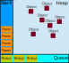

# 简单理解Event-Loop

JavaScript是一门单线程的语言。单线程意味着程序中的任务会一个接着一个执行。如果它是多线程，在执行时会带来一些不确定的因素。比如一个线程在操作某个DOM节点，而另一个线程却在删除该节点，执行的结果应以哪个线程为准呢？可以说，JavaScript会按照语句出现的顺序一个一个被“激活”，但却不一定按这个顺序来“执行”这些任务，比如下方的一个简单程序。激活的顺序应该是Task1 - Task2，但最终执行的顺序却是Task2 - Task1。为什么会这样？让我们来看看JavaScript的运行机制。

```javascript
setTimeOut(function(){
  console.log("Task1")
},3000)
console.log("Task2")
/* Results */
/* Task2 */
/* Task1 */
```

## 单线程、同步、异步、阻塞、非阻塞

首先，我会形象地用我的生活来解释这些概念。

### 单线程

我为每天所罗列的一份todoList，便是JavaScript中的执行栈，主线程（我）会从这份名单中一个一个取出任务来执行。单线程意味着任务是一个接着一个被执行的。比如我刷完牙了才去洗脸，洗完脸了再去准备早饭。而多线程可能是：早上一边刷牙的时候一边烧水煮面准备早饭，两个任务并发进行。

### 同步 & 异步

同步和异步指的是一个任务的任务类型。拿烧水来举例，若烧水是个同步任务，主线程（我）在烧水到水开这2min内，我什么也没干站在旁边等着水开；若烧水是个异步任务，我把火点上后，便去刷牙洗脸了。等到水开（水壶叫）我再跑过去将水关上。JavaScript中的事件便是典型的异步任务：“点火”便是设置监听器，“水壶叫”便是事件触发，“关水”便是回调。

### 阻塞 & 非阻塞

阻塞和非阻塞只的是主线程（我）的状态。若一个任务任务时间过长，我必须干等着而无法开展下一项任务，说明我被阻塞了。如果我能将上一个任务挂着，等待结果的时间去干下一项任务，说明我非阻塞。同步任务不代表一定会阻塞主线程，比如任务很容易执行，那主线程就会一个接一个很流畅进行下去。异步任务也不代表都不会发生阻塞，比如setTimeOut + alert。

## 栈、堆、队列

栈(stack)、堆(heap)和队列(queue)是内存的抽象化分类。



### 栈

栈又被称为执行栈，用来储存待执行函数。主线程会挨个执行栈中弹出的任务。栈中的每一个“任务”又被称为一帧。栈是LIFO（后进先出）。比如嵌套函数：外层函数、内层函数被先、后压入栈，内层函数被先弹出栈给主线程执行。

### 堆

堆是一块儿非结构化储存区域，用来储存各类对象如字面量对象、基本对象、构造函数等。堆中储存的对象在浏览器的整个生命周期都存在，除非垃圾回收机制将其回收。

### 队列

队列与栈相反，是FIFO（先进先出）类型的。其中储存的是待处理的消息，每一个消息都关联着一个处理该消息的回调函数。当栈为空时，队列便会以FIFO原则移出task进入执行栈给主线程来执行。

## 事件循环

``` flow
flow
st=>start: 任务coming
cond1=>condition: 是否为异步任务
cond2=>condition: 执行栈是否为空
op-table=>operation: 异步任务进入Task Table
op-queue=>operation: 回调函数进入Task Queue
op-wait=>operation: 等待执行栈被清空
op-stack1=>operation: 同步任务进入执行栈
op-stack2=>operation: 主线程从执行栈中取任务执行
op-merge=>operation: 执行栈为空后，Task Queue中的任务进入执行栈执行
st->cond1
cond1(no)->op-stack1->op-stack2->op-merge
cond1(yes)->op-table->op-queue->op-wait->cond2
cond2(yes)->op-merge
cond2(no)->op-wait
```

**TO BE CONTINUE.**